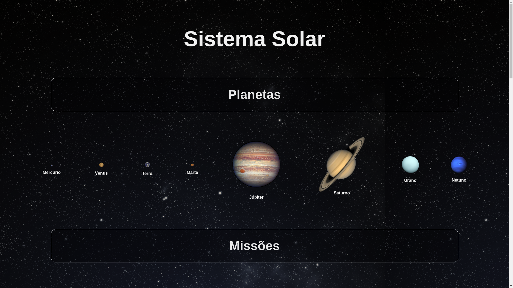
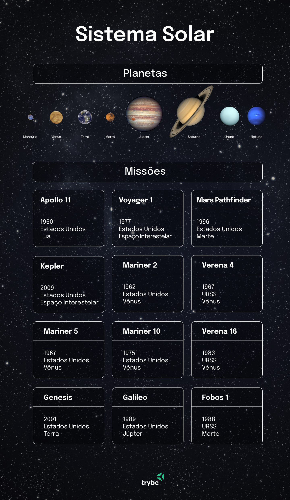

# Projeto Solar System - 

## Projeto Final



## Descrição do Projeto

Projeto desenvolvido durante meu aprendizado no curso de Desenvolvimento Web da [Trybe](https://www.betrybe.com/) (Módulo: Front-end). <br>
`Solar System` é o meu primeiro projeto utilizando `React`, se trata de uma aplicação que lista os planetas do sistema solar e algumas das missões espaciais mais conhecidas.

Nesse projeto coloco em prática o que aprendi sobre utilizar `JSX` no `React`, utilizar corretamente o método 
`render()` para renderizar os componentes, utilizar `import` para trazer componentes em diferentes arquivos, criar componentes de classe em `React`, criar múltiplos componentes a partir de um `array`, fazer uso de `props` corretamente e fazer uso de `PropTypes` para validar as `props` de um componente.

## Funcionalidades

O projeto oferece as seguintes funcionalidades:

- Visualizar todos os planetas do sistema solar renderizados na tela;
- Visualizar todas as cartas com informações sobre missões espaciais.

Funcionalidades adicionais:

- Acessar o conteúdo sobre o assunto na [Wikipédia](https://pt.wikipedia.org/);
- Exibição dos planetas em escala.

## Desenvolvimento

Foi desenvolvido uma aplicação em `React` com criação de componentes de classe e passagem de `props`. Essa aplicação simula uma visualização do Sistema Solar, bem como informações sobre diversas missões espacias que ocorreram ao longo da história.

## Tecnologias Utilizadas

O projeto foi desenvolvido utilizando as seguintes tecnologias:
<p>
  
  
  
  
</p>

## Demostração do funcionamento do projeto


## Como Executar o Projeto

Para executar o projeto em sua máquina local, siga as etapas abaixo:

1. Clone este repositório:
```
git clone git@github.com:mtssantos96/project-solar-system.git
```
2. Acesse o diretório do projeto:
```
cd project-solar-system
```
3. Instale as dependências do projeto `npm install`;
4. Inicie o projeto usando o comando `ǹpm start`.

## Contribuição

Se você quiser contribuir para o desenvolvimento deste projeto, sinta-se à vontade para fazer um fork do repositório e enviar suas sugestões por meio de pull requests. Todas as contribuições são bem-vindas!

## Nota

Esse é o protótipo do esperado do projeto (protótipo criado pela [Trybe](https://www.betrybe.com/)):



# Obrigado pela visita :blue_heart:
